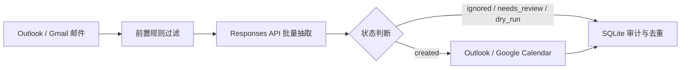
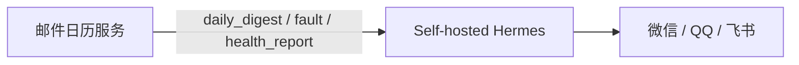

# Outlook Event Automation

把活动邮件自动整理成可信日历事件的常驻服务。

这个项目适合这样的场景：活动信息散落在 Outlook 或 Gmail 邮件里，本地电脑不一定长期在线，学校或组织邮箱也不一定能拿到管理员级 Graph 权限。服务可以部署在服务器上，读取目标邮箱的新邮件，用 OpenAI-compatible Responses API 抽取活动信息，再把足够确定的事件写入 Outlook Calendar 或 Google Calendar。

项目主页：<https://whitesweater.github.io/outlook-event-automation/>

## 给用户看的

你可以把它理解成一个很保守的日历助理：

- 新邮件进入目标邮箱后，服务按固定间隔读取最近邮件。
- AI 提取活动标题、开始时间、结束时间、地点、组织者和摘要。
- 明确不是活动的邮件会被标记为 `ignored`。
- 多活动汇总、取消通知、撤回通知、时间不完整或信息冲突的邮件会进入 `needs_review`。
- 只有足够确定的事件才会写入日历，并记录为 `created`。
- 日历事件正文会包含 AI 摘要、来源邮件主题、发件人、收信时间、邮件链接和原始邮件正文，方便回溯。

默认提示词会尽量把事件标题、说明、地点和复核原因写成中文，同时保留机构名、项目名、房间号等不适合翻译的专有名词。

## 给开发者看的

核心流程是：



主要实现点：

- 邮件源：Microsoft Graph 读取 Outlook，Gmail API 读取 Gmail。
- 日历端：Microsoft Graph 写 Outlook Calendar，Google Calendar API 写 Google Calendar。
- AI 抽取：使用 Responses API 的 JSON schema 输出，每封邮件返回一个结构化判断。
- 批处理：默认 `batch_size = 20`；模型或代理失败时会自动拆批重试。
- 守护规则：`Daily Event Alert` 直接忽略；取消、撤回、多活动或缺时间强制复核。
- 去重审计：SQLite 记录 source message id、dedupe key、处理状态和远端 event id。
- 常驻运行：`serve --write` 可由 systemd 托管，适合部署在小型服务器上。
- 自动推送：通过 Hermes-compatible webhook 产出日报和故障告警，由自托管 Hermes 转发到微信、QQ、飞书。
- Agent 查询：提供轻量 HTTP API，方便 LightVela、Hermes skill 或其他 agent 交互式读取活动摘要与运行状态。

## 目录结构

```text
.
├── docs/
│   └── index.html                  # GitHub Pages 项目主页
└── outlook_event_automation/
    ├── event_agent.py              # 核心 CLI 与服务循环
    ├── config.example.json         # 可提交的配置模板
    ├── .env.example                # 可提交的环境变量模板
    ├── deploy/
    │   ├── outlook-event-agent.service
    │   ├── outlook-event-agent-api.service
    │   ├── outlook-event-agent-digest.service
    │   └── outlook-event-agent-digest.timer
    ├── integrations/
    │   ├── hermes.md
    │   └── lightvela.md
    ├── scripts/
    │   └── install-systemd.sh
    └── data/
        └── .gitkeep                # 运行时 token / SQLite / last_run 不提交
```

## 快速开始

```bash
cd outlook_event_automation
cp config.example.json config.local.json
cp .env.example .env
```

编辑 `config.local.json`：

- `source`: `outlook` 或 `gmail`
- `calendar.sink`: `outlook`、`google` 或 `none`
- `extraction.openai_model`: Responses API 使用的模型名
- `extraction.batch_size`: 每次模型请求处理的邮件数量
- `calendar.include_source_email_body`: 是否把原始邮件正文附到日历事件里

编辑 `.env`：

```text
OPENAI_API_KEY=replace-with-openai-compatible-api-key
MICROSOFT_CLIENT_SECRET=replace-with-client-secret
MICROSOFT_USER_ID=replace-with-mailbox-upn
NOTIFY_WEBHOOK_URL=
NOTIFY_WEBHOOK_TOKEN=
HERMES_WEBHOOK_URL=
HERMES_WEBHOOK_SECRET=
OUTLOOK_AGENT_API_TOKEN=
```

授权 Microsoft：

```bash
python3 event_agent.py --config config.local.json auth-microsoft
```

或授权 Google：

```bash
python3 event_agent.py --config config.local.json auth-google
```

先做一次不写日历的扫描：

```bash
python3 event_agent.py --config config.local.json run \
  --source outlook --sink none --limit 20 --force
```

确认结果后再写入日历：

```bash
python3 event_agent.py --config config.local.json run \
  --source outlook --sink outlook --limit 20 --write
```

## 常驻部署

安装 systemd 服务：

```bash
sudo APP_DIR=/opt/outlook-event-agent bash scripts/install-systemd.sh
```

然后在服务器上编辑：

- `/opt/outlook-event-agent/config.local.json`
- `/opt/outlook-event-agent/.env`

启动与查看日志：

```bash
sudo systemctl start outlook-event-agent
sudo systemctl status outlook-event-agent
journalctl -u outlook-event-agent -f
```

服务默认执行：

```bash
python3 /opt/outlook-event-agent/event_agent.py \
  --config /opt/outlook-event-agent/config.local.json serve --write
```

## Hermes / LightVela 集成

这个组件不直接绑定某一个 IM 平台。现在推荐两条路：

- 自托管 Hermes：本服务主动发送 Hermes webhook，Hermes 负责转发到 `weixin`、`qqbot` 或 `feishu`。
- LightVela：公开文档没有暴露 raw webhook route，更适合作为对话入口，通过 SkillHub 技能访问本项目的 HTTP API。

推荐自托管 Hermes 架构：



开启方式：

1. 在 `config.local.json` 里设置：

```json
{
  "notifications": {
    "enabled": true,
    "provider": "webhook",
    "notify_target": "hermes-webhook",
    "hermes_webhook_url_env": "HERMES_WEBHOOK_URL",
    "hermes_webhook_secret_env": "HERMES_WEBHOOK_SECRET",
    "daily_digest_hours": 24,
    "fault_cooldown_minutes": 30
  }
}
```

2. 在 `.env` 里设置 Hermes route：

```text
HERMES_WEBHOOK_URL=https://your-hermes.example/webhooks/outlook-event-agent
HERMES_WEBHOOK_SECRET=replace-with-route-secret
```

3. 预览日报：

```bash
python3 event_agent.py --config config.local.json notify-digest --hours 24 --dry-run
```

4. 发送日报：

```bash
python3 event_agent.py --config config.local.json notify-digest --hours 24
```

5. 预览健康报告：

```bash
python3 event_agent.py --config config.local.json health-report --dry-run --always
```

6. 服务器上启用每日定时推送：

```bash
sudo systemctl enable --now outlook-event-agent-digest.timer
systemctl list-timers outlook-event-agent-digest.timer
```

webhook payload 统一包含：

- `source`: 固定为 `outlook_event_automation`
- `type`: `daily_digest`、`fault` 或 `health_report`
- `severity`: `info`、`ok` 或 `error`
- `title`: 消息标题
- `markdown`: 适合 IM 展示的 Markdown 文本
- `text`: 去掉简单 Markdown 后的纯文本
- `payload`: 结构化事件、统计或故障上下文

服务常驻运行时，如果邮件读取、AI 抽取或日历写入抛出异常，会发送 `fault` 告警；`fault_cooldown_minutes` 用来避免同一个故障刷屏。

LightVela 或其他 agent 查询 API：

```bash
python3 event_agent.py --config config.local.json api-server
curl -H "Authorization: Bearer $OUTLOOK_AGENT_API_TOKEN" \
  http://127.0.0.1:8791/digest?hours=24
```

更多配置见：

- `outlook_event_automation/integrations/hermes.md`
- `outlook_event_automation/integrations/lightvela.md`

## 状态语义

| 状态 | 含义 |
| --- | --- |
| `created` | 已创建日历事件 |
| `dry_run` | 测试模式下的可写候选，没有真的写日历 |
| `needs_review` | 像活动，但不够确定，需要人工检查 |
| `ignored` | 明确不是要写入日历的活动 |

## 安全边界

不要提交这些文件：

- `.env`
- `config.local.json`
- `outlook_event_automation/data/*.sqlite3`
- OAuth token、扫描日志和 `last_run.json`

仓库里的 `.gitignore` 已经排除了这些运行时文件。公开提交前仍然建议跑一次 secret scan。

## GitHub Pages

项目主页在 `docs/index.html`，GitHub Pages 使用 `main` 分支的 `/docs` 目录发布。

主页内容分成两层：

- 给用户：解释它怎么把邮件变成日历事件，以及为什么有些邮件不会自动写入。
- 给开发者：解释 API、批量抽取、状态机、SQLite 去重和 systemd 部署方式。

主页动效使用 GSAP timeline 与 ScrollTrigger，动效承担“解释流程”的职责，而不是只做装饰。
