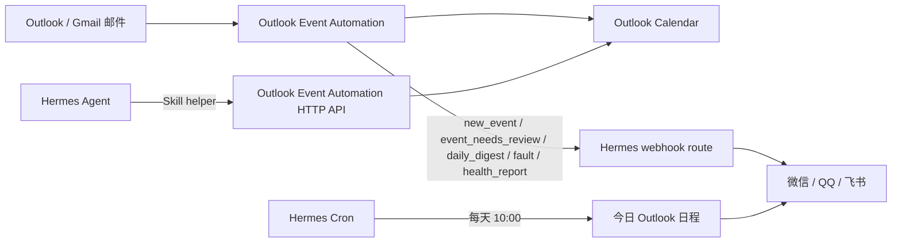

# Hermes 自托管集成与维护手册

本文说明如何把 Outlook Event Automation 接入自托管 Hermes，让微信、QQ、飞书等 IM 渠道可以收到日报、故障告警，并通过 Hermes Agent 交互式查询和新增 Outlook 日程。

参考资料：

- Hermes Messaging Gateway: <https://hermes-agent.nousresearch.com/docs/user-guide/messaging/>
- Hermes Webhooks: <https://hermes-agent.nousresearch.com/docs/user-guide/messaging/webhooks>
- Hermes QQ Bot: <https://hermes-agent.nousresearch.com/docs/user-guide/messaging/qqbot>
- Hermes GitHub 仓库: <https://github.com/NousResearch/hermes-agent>

## 目标架构



边界要清楚：

- 本项目负责读邮件、抽取活动、写日历、提供 HTTP API、产出 webhook payload。
- Hermes 负责 IM 通道绑定、消息投递、Cron、Agent 对话和技能调用。
- 不要为了接入本项目去修改 Hermes 源码；优先使用 Hermes 的 `config.yaml`、`.env`、`skills/`、`scripts/` 和 `cron`。

## 运行目录约定

下面使用一组生产环境路径作为示例。实际部署时可以替换，但建议保持职责分离。

```text
/opt/outlook-event-agent/        # 本项目服务目录
  event_agent.py
  config.local.json              # 不提交
  .env                           # 不提交，0600 权限
  data/                          # token、SQLite、last_run

/opt/hermes-agent/
  app/                           # Hermes 程序本体，尽量不要改
  home/                          # HERMES_HOME
    config.yaml                  # Hermes 运行配置
    .env                         # Hermes 环境变量，0600 权限
    bin/outlook-mail-events      # 只读查询 helper
    skills/outlook-mail-events/
      SKILL.md                   # Hermes Agent 技能说明
    scripts/daily-outlook-agenda.sh
```

## 1. 配置 Outlook Event Automation

`config.local.json` 需要开启 API 和通知。

```json
{
  "notifications": {
    "enabled": true,
    "provider": "webhook",
    "notify_target": "hermes-webhook",
    "hermes_webhook_url_env": "HERMES_WEBHOOK_URL",
    "hermes_webhook_secret_env": "HERMES_WEBHOOK_SECRET",
    "new_event_alerts": true,
    "new_event_alert_statuses": ["created", "needs_review"],
    "daily_digest_hours": 24,
    "fault_cooldown_minutes": 30
  },
  "api": {
    "host": "127.0.0.1",
    "port": 8791,
    "token_env": "OUTLOOK_AGENT_API_TOKEN",
    "allow_write_actions": false,
    "default_hours": 24,
    "default_limit": 20
  }
}
```

`.env` 示例：

```text
OPENAI_API_KEY=replace-with-openai-compatible-api-key
MICROSOFT_CLIENT_SECRET=replace-with-client-secret
MICROSOFT_USER_ID=replace-with-mailbox-upn
HERMES_WEBHOOK_URL=http://127.0.0.1:18644/webhooks/outlook-event-agent
HERMES_WEBHOOK_SECRET=replace-with-route-secret
OUTLOOK_AGENT_API_TOKEN=replace-with-long-random-token
```

权限建议：

```bash
sudo chown outlook-agent:outlook-agent /opt/outlook-event-agent/.env
sudo chmod 600 /opt/outlook-event-agent/.env
```

本项目的 API 默认只监听 `127.0.0.1`，Hermes 同机部署时不需要把它暴露到公网。如果要给外部 agent 访问，请通过 HTTPS 反代，并保留 Bearer token。

## 2. 启动本项目服务

```bash
sudo systemctl enable --now outlook-event-agent.service
sudo systemctl enable --now outlook-event-agent-api.service
systemctl is-active outlook-event-agent.service
systemctl is-active outlook-event-agent-api.service
```

常用验证：

```bash
curl -H "Authorization: Bearer $OUTLOOK_AGENT_API_TOKEN" \
  http://127.0.0.1:8791/health

curl -H "Authorization: Bearer $OUTLOOK_AGENT_API_TOKEN" \
  "http://127.0.0.1:8791/agenda?date=today&limit=50"

curl -H "Authorization: Bearer $OUTLOOK_AGENT_API_TOKEN" \
  "http://127.0.0.1:8791/agenda-range?date=today&days=7&limit=100"
```

`/agenda` 和 `/agenda-range` 读取 Outlook Calendar，Microsoft scopes 至少需要 `Calendars.Read` 或 `Calendars.ReadWrite`。

## 3. 配置 Hermes 模型 provider

Hermes 需要能调用 OpenAI-compatible 模型。推荐配置一个命名 provider，并用 `key_env` 从 Hermes `.env` 读取 API key。

`/opt/hermes-agent/home/.env`：

```text
SG8317_API_KEY=replace-with-api-key
OUTLOOK_AGENT_API_BASE=http://127.0.0.1:8791
OUTLOOK_AGENT_API_TOKEN=replace-with-same-token-as-outlook-agent
```

`/opt/hermes-agent/home/config.yaml` 示例：

```yaml
model:
  provider: sg8317
  default: gpt-5.5
  model: gpt-5.5
  api_mode: chat_completions

providers:
  sg8317:
    name: SG OpenAI-compatible
    api: http://your-openai-compatible-host:8317/v1
    key_env: SG8317_API_KEY
    default_model: gpt-5.5
    transport: chat_completions
    models:
      gpt-5.5:
        context_length: 272000
      gpt-5.4:
        context_length: 272000
      gpt-5.4-mini:
        context_length: 272000
```

重要排查点：

- 如果模型端点需要 API key，不要只写 `model.provider: custom` 加 `base_url`。某些 Hermes 版本会把裸 `custom` 当作无 key provider，最后模型端返回 `HTTP 401 Invalid API key`。
- 使用命名 provider，例如 `sg8317`，让 Hermes 通过 `providers.sg8317.key_env` 读取密钥。
- 如果确实遇到 streaming 兼容问题，优先在 `config.yaml` 里设置 provider 或 model 的 stream 选项；不要修改 Hermes 源码。

验证：

```bash
cd /opt/hermes-agent
set -a
. /opt/hermes-agent/home/.env
set +a
HERMES_HOME=/opt/hermes-agent/home \
  /opt/hermes-agent/app/venv/bin/hermes chat -Q \
  --provider sg8317 -m gpt-5.5 -q "只回复 PONG"
```

预期输出包含 `PONG`。

## 4. 配置 Hermes webhook route

在 Hermes `config.yaml` 中开启 webhook 平台，增加一个 route。

```yaml
platforms:
  webhook:
    enabled: true
    extra:
      host: 127.0.0.1
      port: 18644
      routes:
        outlook-event-agent:
          events:
            - new_event
            - event_needs_review
            - daily_digest
            - fault
            - health_report
          secret: replace-with-route-secret
          prompt: "{markdown}"
          deliver: weixin
          deliver_only: true
```

说明：

- `secret` 要和本项目 `.env` 的 `HERMES_WEBHOOK_SECRET` 一致。
- `prompt` 必须使用 `{markdown}` 或 `{text}`。不要用 `{__raw__}`，否则微信/QQ 会收到完整 JSON envelope，中文字段也可能显示成 `\u53d1\u73b0...` 这类 Unicode 转义。
- webhook route 的 `deliver` 只填平台名，例如 `weixin`、`qqbot`、`feishu` 或 `log`。`qqbot:<chat_id>` 这种精确目标格式适用于 `hermes send` 和 `hermes cron`，不适用于 webhook route。
- `deliver_only: true` 表示不调用模型，直接把 `prompt` 投递到 IM。
- webhook 建议只监听内网或 loopback；需要公网访问时放到 HTTPS 反代后面。

本项目发送给 Hermes 的 JSON envelope 包含：

- `source`: 固定为 `outlook_event_automation`
- `event_type`: `new_event`、`event_needs_review`、`daily_digest`、`fault` 或 `health_report`
- `severity`: `info`、`warning`、`ok` 或 `error`
- `title`: 消息标题
- `markdown`: 给 IM 展示的正文
- `text`: 去掉简单 Markdown 后的纯文本
- `payload`: 新活动摘要、统计、事件列表、最近运行状态或故障上下文

请求头包含：

- `X-Webhook-Signature`: `HMAC-SHA256(secret, raw_body)` 的 hex digest
- `X-Request-ID`: 用于 Hermes 幂等去重

验证本项目发 webhook：

```bash
cd /opt/outlook-event-agent
sudo -u outlook-agent python3 event_agent.py \
  --config config.local.json notify-digest --hours 24 --dry-run

sudo -u outlook-agent python3 event_agent.py \
  --config config.local.json notify-digest --hours 24 \
  --notify-target hermes-webhook
```

实时事件提醒由常驻扫描自动触发：当一封新邮件第一次被记录为 `created` 时，Hermes 会收到
`new_event` 并推送“新活动已加入日历”；当它被记录为 `needs_review` 时，Hermes 会收到
`event_needs_review` 并推送“发现疑似新活动，需要确认”。重复邮件、已处理邮件、dry run、
`ignored` 和 `Daily Event Alert` 不会触发实时提醒。可以用
`notifications.new_event_alert_statuses` 控制哪些状态会推送。

如果某类活动不应该进入个人日历，也不应该触发新事件提醒，把关键词加入
`extraction.auto_ignore_keywords`。这些关键词会在 AI 抽取前后各检查一次；命中后记录为
`ignored`。适合放运营类通知，例如消防演练、发电机负载测试、设备测试等。

## 5. 配置 Hermes Skill 查询与新增日程

Hermes Agent 需要一个 helper 来访问本项目 API。helper 放在 Hermes home，不放在 Hermes 源码目录。查询命令是只读的；新增日程必须走 `create-event-json`，并且 API 请求体要包含 `confirmed: true`。

`/opt/hermes-agent/home/bin/outlook-mail-events`：

```bash
#!/usr/bin/env bash
set -euo pipefail

ENV_FILE="/opt/hermes-agent/home/.env"
if [[ -f "$ENV_FILE" ]]; then
  set -a
  # shellcheck disable=SC1090
  source "$ENV_FILE"
  set +a
fi

BASE="${OUTLOOK_AGENT_API_BASE:-http://127.0.0.1:8791}"
TOKEN="${OUTLOOK_AGENT_API_TOKEN:-}"
if [[ -z "$TOKEN" ]]; then
  echo '{"error":"OUTLOOK_AGENT_API_TOKEN missing in Hermes env"}' >&2
  exit 2
fi

endpoint="${1:-digest}"
if [[ $# -gt 0 ]]; then
  shift
fi

case "$endpoint" in
  agenda)
    date_value="${1:-today}"
    limit="${2:-50}"
    path="/agenda?date=${date_value}&limit=${limit}"
    ;;
  agenda-range)
    days="${1:-7}"
    date_value="${2:-today}"
    limit="${3:-100}"
    path="/agenda-range?date=${date_value}&days=${days}&limit=${limit}"
    ;;
  digest)
    hours="${1:-24}"
    limit="${2:-20}"
    path="/digest?hours=${hours}&limit=${limit}"
    ;;
  health)
    path="/health"
    ;;
  events)
    status="${1:-created}"
    hours="${2:-24}"
    limit="${3:-20}"
    path="/events?status=${status}&hours=${hours}&limit=${limit}"
    ;;
  review)
    hours="${1:-24}"
    limit="${2:-20}"
    path="/review?hours=${hours}&limit=${limit}"
    ;;
  last-run)
    path="/last-run"
    ;;
  create-event-json)
    curl -sS -X POST \
      -H "Authorization: Bearer ${TOKEN}" \
      -H "Content-Type: application/json" \
      --data-binary @- \
      "${BASE}/calendar-events"
    exit 0
    ;;
  *)
    echo "Usage: outlook-mail-events [agenda [today|tomorrow|YYYY-MM-DD limit]|agenda-range [days date limit]|digest [hours limit]|health|events [status hours limit]|review [hours limit]|last-run|create-event-json]" >&2
    exit 64
    ;;
esac

curl -sS -H "Authorization: Bearer ${TOKEN}" "${BASE}${path}"
```

安装：

```bash
sudo install -o ubuntu -g ubuntu -m 0700 outlook-mail-events \
  /opt/hermes-agent/home/bin/outlook-mail-events
```

`/opt/hermes-agent/home/skills/outlook-mail-events/SKILL.md`：

```markdown
---
name: outlook-mail-events
description: Query the Outlook Event Automation service for Outlook Calendar agenda, multi-day agenda ranges, mail-derived calendar events, pending reviews, digests, health, recent run status, and create confirmed manual Outlook Calendar events.
---

# Outlook Mail And Calendar Queries

Use this skill when the user asks about today's schedule, tomorrow's schedule, the next few days, the next week, recent mail-derived events, pending review emails, calendar sync health, whether the mail automation is working, or adding a clearly confirmed Outlook Calendar event.

The local helper is:
`/opt/hermes-agent/home/bin/outlook-mail-events`

Commands:
- `/opt/hermes-agent/home/bin/outlook-mail-events agenda today 50` for today's Outlook Calendar agenda.
- `/opt/hermes-agent/home/bin/outlook-mail-events agenda tomorrow 50` for tomorrow's agenda.
- `/opt/hermes-agent/home/bin/outlook-mail-events agenda YYYY-MM-DD 50` for a specific day.
- `/opt/hermes-agent/home/bin/outlook-mail-events agenda-range 3 today 100` for the next 3 days.
- `/opt/hermes-agent/home/bin/outlook-mail-events agenda-range 7 today 100` for the next week.
- `/opt/hermes-agent/home/bin/outlook-mail-events digest 24 20` for recent mail activity summary.
- `/opt/hermes-agent/home/bin/outlook-mail-events review 24 20` for pending review emails.
- `/opt/hermes-agent/home/bin/outlook-mail-events events created 24 20` for created calendar events.
- `/opt/hermes-agent/home/bin/outlook-mail-events health` for service health.
- `/opt/hermes-agent/home/bin/outlook-mail-events last-run` for last scan details.
- `cat event.json | /opt/hermes-agent/home/bin/outlook-mail-events create-event-json` to create a confirmed Outlook Calendar event.

Read the JSON, then answer in Chinese by default. Prefer the `markdown` field when it exists. For questions like “最近三天有什么日程” or “最近一周有哪些安排”, call `agenda-range` with `3` or `7` days. Do not expose `OUTLOOK_AGENT_API_TOKEN`, webhook secrets, raw `.env` contents, or full email bodies unless the user explicitly asks for source detail.

For adding a calendar event:

1. Resolve relative dates in `Asia/Shanghai` and state the exact date and time back to the user.
2. Ask for confirmation unless the user's latest message already explicitly confirms the exact title, date, time, timezone, and Outlook Calendar target.
3. After confirmation, call `create-event-json` with JSON like:

```json
{
  "confirmed": true,
  "title": "字节跳动面试",
  "start_time": "2026-06-25T11:00:00+08:00",
  "end_time": "2026-06-25T12:00:00+08:00",
  "timezone": "Asia/Shanghai",
  "location": "",
  "description": "通过 Hermes 手动添加。"
}
```

For validation without writing, include `"dry_run": true`. Do not create events if the date, time, or title is ambiguous. This skill can add confirmed events, but it does not update or delete existing events.
```

验证 helper：

```bash
sudo -u ubuntu /opt/hermes-agent/home/bin/outlook-mail-events agenda today 50
sudo -u ubuntu /opt/hermes-agent/home/bin/outlook-mail-events agenda-range 7 today 100
sudo -u ubuntu /opt/hermes-agent/home/bin/outlook-mail-events health
cat <<'JSON' | sudo -u ubuntu /opt/hermes-agent/home/bin/outlook-mail-events create-event-json
{
  "dry_run": true,
  "confirmed": true,
  "title": "字节跳动面试",
  "start_time": "2026-06-25T11:00:00+08:00",
  "end_time": "2026-06-25T12:00:00+08:00",
  "timezone": "Asia/Shanghai",
  "description": "通过 Hermes 手动添加。"
}
JSON
```

验证 Hermes Agent 能调用技能：

```bash
cd /opt/hermes-agent
set -a
. /opt/hermes-agent/home/.env
set +a
HERMES_HOME=/opt/hermes-agent/home \
  /opt/hermes-agent/app/venv/bin/hermes chat -Q \
  -s outlook-mail-events \
  -q "请调用 outlook-mail-events 技能查询最近一周的 Outlook 日程安排，用中文简短回答，列出日期、时间、标题和地点。"
```

## 6. 配置每天 10:00 自动推送今日日程

Hermes Cron 适合做定时 IM 推送。推荐 `--no-agent --script` 模式：脚本直接输出 Markdown，Hermes 只负责定时和投递，不消耗模型。

`/opt/hermes-agent/home/scripts/daily-outlook-agenda.sh`：

```bash
#!/usr/bin/env bash
set -euo pipefail
/opt/hermes-agent/home/bin/outlook-mail-events agenda today 50 \
  | python3 -c 'import json, sys; payload=json.load(sys.stdin); markdown=payload.get("markdown") or payload.get("text") or ""; print(markdown.strip() if markdown.strip() else json.dumps(payload, ensure_ascii=False, indent=2))'
```

安装：

```bash
sudo install -o ubuntu -g ubuntu -m 0700 daily-outlook-agenda.sh \
  /opt/hermes-agent/home/scripts/daily-outlook-agenda.sh
```

创建 cron：

```bash
cd /opt/hermes-agent
HERMES_HOME=/opt/hermes-agent/home \
  /opt/hermes-agent/app/venv/bin/hermes cron create \
  --name daily-outlook-agenda \
  --deliver weixin \
  --script daily-outlook-agenda.sh \
  --no-agent \
  "0 10 * * *"
```

检查：

```bash
HERMES_HOME=/opt/hermes-agent/home \
  /opt/hermes-agent/app/venv/bin/hermes cron list

HERMES_HOME=/opt/hermes-agent/home \
  /opt/hermes-agent/app/venv/bin/hermes cron status
```

如果目标不是微信，把 `--deliver weixin` 换成已绑定的目标。可以先查看可用发送目标：

```bash
HERMES_HOME=/opt/hermes-agent/home \
  /opt/hermes-agent/app/venv/bin/hermes send --list
```

如果微信通道容易触发短时间限流，可以在 Hermes `config.yaml` 的微信平台配置里增加重试参数。不同 Hermes 版本的配置结构可能略有差异，生产环境以 `hermes doctor` 和实际 `config.yaml` schema 为准；本项目使用的是 top-level `platforms.weixin.extra`：

```yaml
platforms:
  weixin:
    extra:
      send_chunk_retries: 6
      send_chunk_retry_delay_seconds: 12
      rate_limit_circuit_threshold: 10
      rate_limit_circuit_window_seconds: 60
      rate_limit_circuit_open_seconds: 30
```

更新后重启 Hermes：

```bash
sudo systemctl restart hermes-agent.service
systemctl is-active hermes-agent.service
```

如果要临时兜底，把 webhook route 改成 QQ 平台，把 cron 目标改成已经绑定的 QQ chat：

```yaml
platforms:
  webhook:
    extra:
      routes:
        outlook-event-agent:
          deliver: qqbot
          prompt: "{markdown}"
```

```bash
cd /opt/hermes-agent
HERMES_HOME=/opt/hermes-agent/home \
  /opt/hermes-agent/app/venv/bin/hermes cron edit daily-outlook-agenda \
  --deliver 'qqbot:<chat_id>'
```

也可以保留微信日报，把故障/人工提醒 route 配到 QQ 或飞书。关键是：通道绑定和限流属于 Hermes 运行配置，不要修改 Hermes 源码。改完 `config.yaml` 后重启 Hermes；如果旧进程正在被微信限流拖住并长时间停在 `deactivating`，先确认日志里确实是旧微信投递在退避，再回收旧 gateway 进程并启动新进程。

## 7. 运维检查清单

服务状态：

```bash
systemctl is-active outlook-event-agent.service
systemctl is-active outlook-event-agent-api.service
systemctl is-active hermes-agent.service
```

日志：

```bash
journalctl -u outlook-event-agent.service -n 100 --no-pager
journalctl -u outlook-event-agent-api.service -n 100 --no-pager
journalctl -u hermes-agent.service -n 100 --no-pager
```

端到端检查：

```bash
# 1. Outlook agent API
curl -H "Authorization: Bearer $OUTLOOK_AGENT_API_TOKEN" \
  http://127.0.0.1:8791/health

# 1b. 本服务 webhook 通知健康报告
cd /opt/outlook-event-agent
python3 event_agent.py --config config.local.json health-report --dry-run --always

# 2. 今日/未来一周日程
/opt/hermes-agent/home/bin/outlook-mail-events agenda today 50
/opt/hermes-agent/home/bin/outlook-mail-events agenda-range 7 today 100

# 3. Hermes 模型
HERMES_HOME=/opt/hermes-agent/home \
  /opt/hermes-agent/app/venv/bin/hermes chat -Q -q "只回复 PONG"

# 4. Hermes 技能查询
HERMES_HOME=/opt/hermes-agent/home \
  /opt/hermes-agent/app/venv/bin/hermes chat -Q \
  -s outlook-mail-events \
  -q "查询最近一周日程，中文列出日期、时间、标题、地点。"
```

## 8. 常见问题

### Hermes 报 `HTTP 401 Invalid API key`

优先检查：

1. API key 额度是否可用。
2. Hermes `.env` 是否包含 provider 的 `key_env`，例如 `SG8317_API_KEY`。
3. `config.yaml` 的默认 provider 是否是命名 provider，例如 `provider: sg8317`，而不是裸 `custom`。
4. 使用 `--provider sg8317 -m gpt-5.5` 单独测试模型。

不要通过修改 Hermes 源码绕过 401。

### Hermes 查不到日程

按顺序检查：

1. `outlook-event-agent-api.service` 是否 active。
2. `OUTLOOK_AGENT_API_TOKEN` 是否在 Outlook agent 和 Hermes `.env` 中一致。
3. `outlook-mail-events agenda-range 7 today 100` 是否能返回 JSON。
4. Microsoft token 是否过期或 scopes 缺少 `Calendars.ReadWrite`。
5. 如果 JSON 有事件但 Hermes 回复不完整，优化 skill 提示，而不是改 API 安全边界。

### 日程有标题地点，但日期时间显示“待确认”

Microsoft Graph 可能返回 `2026-06-24T15:40:00.0000000` 这类 7 位小数秒时间。本项目已经在 `parse_datetime` 中兼容该格式。遇到类似问题时，先检查本项目版本是否包含该修复，再看 `/agenda-range` 的原始 JSON。

### 每天 10:00 没收到推送

检查：

1. `hermes cron list` 中 job 是否 active。
2. `hermes-agent.service` 是否 active。
3. `daily-outlook-agenda.sh` 是否可执行。
4. `outlook-mail-events agenda today 50` 是否有输出。
5. `hermes send --list` 中目标是否仍然绑定。

建议按下面顺序定位：

```bash
# 1. 三个服务都应该是 active
systemctl is-active outlook-event-agent.service
systemctl is-active outlook-event-agent-api.service
systemctl is-active hermes-agent.service

# 2. 看 cron 上次运行和投递错误
HERMES_HOME=/opt/hermes-agent/home \
  /opt/hermes-agent/app/venv/bin/hermes cron list
HERMES_HOME=/opt/hermes-agent/home \
  /opt/hermes-agent/app/venv/bin/hermes cron status

# 3. 直接跑脚本，确认本项目 API 能返回今日日程
sudo -u ubuntu /opt/hermes-agent/home/scripts/daily-outlook-agenda.sh

# 4. 单独测试投递目标
HERMES_HOME=/opt/hermes-agent/home \
  /opt/hermes-agent/app/venv/bin/hermes send --to weixin "Hermes 投递测试"
```

如果 `last_delivery_error` 里出现 `rate limited` 或 cooldown 文案，通常不是 Outlook 日程查询失败，而是微信通道被限流。先等待 cooldown，再用上面的微信重试配置；仍不稳定时，把日报或故障告警切到 QQ fallback。

如果 `hermes cron list` 显示 `Last run ... ok`，但 IM 没收到，继续看 `journalctl -u hermes-agent.service`。脚本运行成功只代表 `daily-outlook-agenda.sh` 产出了内容；最终是否投递到微信/QQ，还要看 Hermes 平台日志。

### 微信/QQ 推送显示完整 JSON 或 `\uXXXX` 转义

这通常是 webhook route 的 `prompt` 写成了 `{__raw__}`，Hermes 把整个请求体直接投递了。修复方式：

```yaml
platforms:
  webhook:
    extra:
      routes:
        outlook-event-agent:
          prompt: "{markdown}"
```

然后重启 Hermes，并用健康报告验证：

```bash
cd /opt/outlook-event-agent
sudo python3 event_agent.py --config config.local.json \
  health-report --always --notify-target hermes-webhook
```

成功时命令会打印 `Notification sent: target=hermes-webhook type=health_report status=200`，IM 中应该只出现中文 Markdown 摘要，不应该出现完整 JSON。

如果要立刻补发一次日报：

```bash
HERMES_HOME=/opt/hermes-agent/home \
  /opt/hermes-agent/app/venv/bin/hermes cron run daily-outlook-agenda
HERMES_HOME=/opt/hermes-agent/home \
  /opt/hermes-agent/app/venv/bin/hermes cron tick
```

## 9. 维护原则

- 密钥只放 `.env`，不要写进 Git、README、Hermes skill 或脚本。
- Hermes 源码目录只作为上游程序使用；项目适配放在 Hermes home 的 `config.yaml`、`skills/`、`scripts/`、`bin/`。
- 本项目 HTTP API 默认只读。只有确实要让 Hermes 管理日程时才开启 `allow_write_actions=true`，并保留 `confirmed: true` 确认流程。
- 交互式查询用 `/agenda`、`/agenda-range`、`/digest`、`/review`、`/health`；新增用户确认过的日程用 `/calendar-events`。
- 本服务主动发送 webhook 的失败会写入 `data/notification_state.json` 并出现在 `health-report`；Hermes Cron 直接投递失败要看 `hermes cron list/status`。
- 改动后至少验证：`python3 -m py_compile event_agent.py`、API `/health`、helper `agenda-range`、`create-event-json` dry run、Hermes skill 查询、Hermes Cron 日报投递。
