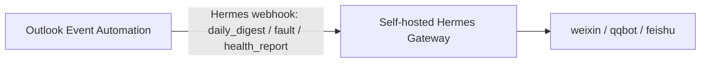

# Hermes 自托管集成

这个路径用于自托管 Hermes Gateway。LightVela 是托管产品，公开文档没有提供用户可直接配置的 raw webhook route；如果要让邮件日历服务主动推送到微信、QQ 或飞书，推荐在 SG 服务器上跑一个独立 Hermes。

参考资料：

- Hermes Webhooks: <https://hermes-agent.nousresearch.com/docs/user-guide/messaging/webhooks>
- Hermes Messaging Gateway: <https://hermes-agent.nousresearch.com/docs/user-guide/messaging/>
- Hermes QQ Bot: <https://hermes-agent.nousresearch.com/docs/user-guide/messaging/qqbot>
- Hermes GitHub 仓库: <https://github.com/NousResearch/hermes-agent>

## 推荐架构



本项目只负责把结构化消息送到 Hermes。微信、QQ、飞书的账号绑定由 Hermes 负责。

## Hermes route

在 Hermes `~/.hermes/config.yaml` 中准备一个 route。正式推送时把 `deliver` 改成已经绑定好的目标，例如 `weixin`、`qqbot` 或 `feishu`。

```yaml
platforms:
  webhook:
    enabled: true
    extra:
      port: 8644
      routes:
        outlook-event-agent:
          events: ["daily_digest", "fault", "health_report"]
          secret: "replace-with-a-long-random-secret"
          prompt: "{markdown}"
          deliver: "weixin"
          deliver_only: true
```

注意：

- `deliver_only: true` 不会调用模型，只把渲染后的 `prompt` 直接发到目标渠道。
- Hermes 要求 direct delivery 的 `deliver` 必须是真实渠道，不能是 `log`。
- 还没绑定微信或 QQ 时，可以先临时用非 direct 模式加 `deliver: "log"` 做日志验证。
- Hermes webhook URL 通常是 `http://<server>:8644/webhooks/outlook-event-agent`，建议生产环境放到 HTTPS 反代后面。

## 本项目配置

`config.local.json`：

```json
{
  "notifications": {
    "enabled": true,
    "provider": "webhook",
    "notify_target": "hermes-webhook",
    "hermes_webhook_url_env": "HERMES_WEBHOOK_URL",
    "hermes_webhook_secret_env": "HERMES_WEBHOOK_SECRET",
    "daily_digest_hours": 24,
    "fault_cooldown_minutes": 30
  }
}
```

`.env`：

```text
HERMES_WEBHOOK_URL=https://your-hermes.example/webhooks/outlook-event-agent
HERMES_WEBHOOK_SECRET=replace-with-the-route-secret
```

## 手动验证

预览日报：

```bash
python3 event_agent.py --config config.local.json notify-digest --hours 24 --dry-run
```

发送到 Hermes：

```bash
python3 event_agent.py --config config.local.json notify-digest \
  --hours 24 --notify-target hermes-webhook
```

发送健康报告：

```bash
python3 event_agent.py --config config.local.json health-report \
  --always --notify-target hermes-webhook
```

本项目发往 Hermes 的 JSON envelope 包含：

- `source`: 固定为 `outlook_event_automation`
- `event_type`: `daily_digest`、`fault` 或 `health_report`
- `severity`: `info`、`ok` 或 `error`
- `title`: 消息标题
- `markdown`: 给 IM 展示的正文
- `text`: 去掉简单 Markdown 后的纯文本
- `payload`: 统计、事件列表、最近运行状态或故障上下文

请求头包含：

- `X-Webhook-Signature`: `HMAC-SHA256(secret, raw_body)` 的 hex digest
- `X-Request-ID`: 用于 Hermes 幂等去重

## 常态化推送

服务循环中出现异常时会自动发送 `fault`，并受 `fault_cooldown_minutes` 控制，避免刷屏。

每日摘要可以用仓库里的 systemd timer：

```bash
sudo systemctl enable --now outlook-event-agent-digest.timer
systemctl list-timers outlook-event-agent-digest.timer
```

如果需要让其他 agent 交互式查询当前邮件活动状态，启用轻量 HTTP API：

```bash
sudo systemctl enable --now outlook-event-agent-api.service
curl -H "Authorization: Bearer $OUTLOOK_AGENT_API_TOKEN" \
  http://127.0.0.1:8791/digest?hours=24
```
