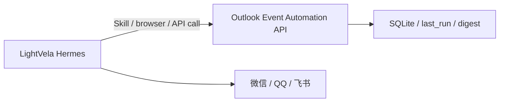

# LightVela 集成说明

LightVela 是腾讯轻量云团队提供的云端托管 Hermes。公开文档描述的配置面主要是模型、通道和 SkillHub 技能；它不适合需要把 Agent 集成进自有网站或应用的开发者，也没有在公开文档中暴露 raw webhook route。

参考资料：

- LightVela 概览: <https://lightvela.com/docs/overview/>
- LightVela 核心概念: <https://lightvela.com/docs/core-concepts/>
- LightVela 配置技能: <https://lightvela.com/docs/configuration/skill/>

## 当前结论

如果只使用 LightVela，邮件日历服务不应该假设可以主动 POST 到 LightVela webhook。更稳妥的方式是让 LightVela 里的 Hermes 通过技能来访问本项目的 HTTP API：



也就是说：

- 事件主动推送：用自托管 Hermes webhook，见 `integrations/hermes.md`。
- 交互式查询：LightVela 可通过 SkillHub 技能或浏览器/API 技能访问本项目的 HTTP API。

## 轻量 HTTP API

默认只监听本机：

```bash
python3 event_agent.py --config config.local.json api-server
```

主要接口：

```text
GET  /                         # 查看路由
GET  /health                   # 服务健康报告
GET  /digest?hours=24&limit=20 # 活动摘要，含 markdown
GET  /agenda?date=today        # 指定日期的 Outlook Calendar 日程
GET  /agenda-range?days=7      # 多日 Outlook Calendar 日程
GET  /events?status=created    # 已处理事件
GET  /review                   # needs_review 邮件
GET  /last-run                 # 最近一次扫描结果
POST /scan?source=outlook      # 默认 dry scan，不写日历
```

如果要给 LightVela 或外部 agent 访问，需要做两件事：

1. 配置 token。

```text
OUTLOOK_AGENT_API_TOKEN=replace-with-a-long-random-token
```

2. 通过 HTTPS 反代暴露 API，不建议直接裸露 Python HTTP 服务。

`config.local.json` 示例：

```json
{
  "api": {
    "host": "127.0.0.1",
    "port": 8791,
    "token_env": "OUTLOOK_AGENT_API_TOKEN",
    "allow_write_actions": false,
    "default_hours": 24,
    "default_limit": 20
  }
}
```

外部调用示例：

```bash
curl -H "Authorization: Bearer $OUTLOOK_AGENT_API_TOKEN" \
  https://your-agent-api.example/digest?hours=24
```

## 给 LightVela 对话使用的提示

等 API 暴露并确认 token 后，可以在 LightVela 中安装可访问网页或 HTTP API 的技能，然后在微信/QQ/飞书中这样问：

```text
请使用 HTTP/API 技能访问我的活动邮件服务：
GET https://your-agent-api.example/digest?hours=24
Authorization: Bearer <token>

把 markdown 字段整理成今天的活动摘要发给我。
```

`POST /scan` 默认不写日历。只有同时满足下面两个条件才允许外部触发真实写入：

- 请求里带 `write=true`
- `config.local.json` 里设置 `"allow_write_actions": true`

生产环境建议保持 `allow_write_actions: false`，让日历写入只由本项目常驻服务负责。
